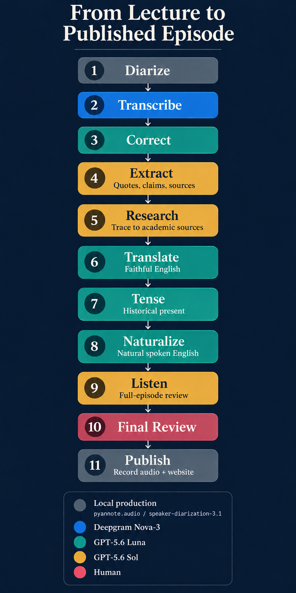

# History, Told Otherwise

[History, Told Otherwise](https://podcast.enucatl.com) is an independent podcast of English
adaptations of selected Alessandro Barbero history lectures. Each episode keeps Barbero’s
narrative voice and historical texture while adding careful source research, faithful translation,
and editorial work for an English-speaking listener. The project is unofficial and is not
affiliated with or endorsed by Alessandro Barbero.

The released website includes the episode catalogue and an RSS feed for Apple Podcasts or any
other podcast app: [podcast.enucatl.com](https://podcast.enucatl.com).

## The agentic research workflow

This repository contains the private production system behind the podcast. It is an explicit-only
Codex repository skill, [`$produce-barbero-episode`](.agents/skills/produce-barbero-episode/), that
coordinates bounded agents around durable, reviewable episode artifacts. Python owns deterministic
transformations, hashes, validation, and status; agents own interpretation, research, translation,
and editorial proposals.



### Model boundaries

- **GPT-6 Luna** handles bounded production work: transcript uncertainty review, chapter and
  outline structure, faithful translation, proposal drafting, tense, naturalness, and final
  integration.
- **GPT-6 Sol** handles evidence-heavy work: individual historical research, the whole research
  audit.
- **GPT-6 Astra** handles whole-episode listener synthesis, combining the complete spoken script
  and outline into audience-focused editorial proposals.
- No external-model fallback is used. Sol may return a blocked finding; it may not lower the
  evidence standard.

The skill specifies stage models and reasoning efforts for the Codex host; the Python CLI does
not call or select an OpenAI model. See the [prompting review](docs/episode-prompting-review.md) for
the GPT-6 guidance, changes, and a representative evaluation procedure.

### Artifact-gated progress

`barbero status EPISODE --json` reports the current `stage`, its `kind` (`machine`, `agent`,
`human`, `complete`, or `invalid`), the next action, blocking items, and relevant artifact paths.
The same result powers the human-readable status output, so an interrupted run resumes from the
last validated artifact rather than from a separate run ledger.

The durable checkpoints are deliberately visible:

- `transcript-uncertainties.yaml` begins at `acoustic-complete`; the semantic Luna pass must mark it
  `complete` before the transcript human gate opens.
- `script.it.md`, `outline.md`, the quotation/claim/source ledgers, and
  `research-audit.yaml` establish research readiness. The audit stores SHA-256 hashes of all five
  inputs; faithful translation is blocked if the audit is absent, blocked, or stale.
- `content-corrections.yaml` and `listener-review.yaml` are the remaining editorial decision
  queues. Humans accept or reject proposals; Python applies accepted patches exactly once and
  preserves quotation, chapter, and transcript boundaries.

## Running the pipeline

```bash
uv sync
uv run barbero init \
  --number 21 --slug il-cavaliere --title "Il cavaliere" \
  --source ~/data/barbero/raw/21.mp3
uv run barbero prepare episodes/021-il-cavaliere/episode.yaml
uv run barbero speakers episodes/021-il-cavaliere/episode.yaml --show
uv run barbero speakers episodes/021-il-cavaliere/episode.yaml --select SPEAKER_00
uv run barbero transcribe episodes/021-il-cavaliere/episode.yaml
uv run barbero render episodes/021-il-cavaliere/episode.yaml
uv run barbero status episodes/021-il-cavaliere --json
```

After speaker selection and the transcript, content, and listener decisions are resolved, validate
the final script. Once recorded audio and publication metadata are available, build the tokenized,
unlisted preview:

```bash
uv run barbero validate episodes/021-il-cavaliere
uv run barbero publish-preview
```

The publisher scans eligible episodes and does not accept a positional episode argument. Verify
the target episode appears in the page, feed, and media output before marking `preview_published`
in its metadata. The skill's [execution reference](.agents/skills/produce-barbero-episode/references/execution.md)
maps intermediate stages to commands and explains resuming partial chapter work.
This marks a local build: current Caddy configuration does not serve token-prefixed previews.
Report its local path; a reachable private preview requires a serving change.

For example, invoke the workflow with a concrete scope:

```text
$produce-barbero-episode resume episodes/021-come-pensava-un-uomo-del-medioevo-il-cavaliere
through its unlisted preview. Preserve existing decisions and completed artifacts.
```

A request can also target analysis or one stage. The workflow continues through authorized work
and presents concrete pending decisions when user input is needed.

Public release, commits, pushes, provider changes, and overwriting an existing episode require
separate explicit authorization.

## Development

```bash
uv run ruff format .
uv run ruff check .
uv run pytest -q
```

Source audio and provider responses stay outside Git. Reviewed text, research ledgers, decision
queues, hashes, and patch provenance are committed under `episodes/`.
