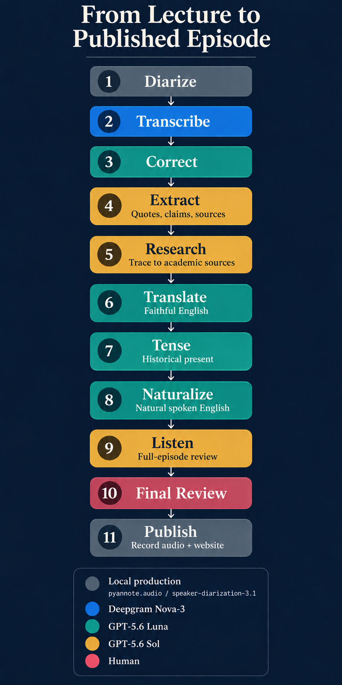

# History, Told Otherwise

[History, Told Otherwise](https://podcast.enucatl.com) is an independent podcast of English
adaptations of selected Alessandro Barbero history lectures. Each episode keeps Barbero’s
narrative voice and historical texture while adding careful source research, faithful translation,
and editorial work for an English-speaking listener. The project is unofficial and is not
affiliated with or endorsed by Alessandro Barbero.

The released website includes the episode catalogue and an RSS feed for Apple Podcasts or any
other podcast app: [podcast.enucatl.com](https://podcast.enucatl.com).

## The agentic research workflow

This repository contains the private production system behind the podcast. It is an explicit-only
Codex repository skill, [`$produce-barbero-episode`](.agents/skills/produce-barbero-episode/), that
coordinates bounded agents around durable, reviewable episode artifacts. Python owns deterministic
transformations, hashes, validation, and status; agents own interpretation, research, translation,
and editorial proposals.



### Model boundaries

- **GPT-6 Luna** handles bounded production work: transcript uncertainty review, chapter and
  outline structure, faithful translation, proposal drafting, tense, naturalness, and final
  integration.
- **GPT-6 Sol** handles evidence-heavy work: individual historical research, the whole research
  audit.
- **GPT-6 Astra** handles whole-episode listener synthesis, combining the complete spoken script
  and outline into audience-focused editorial proposals.
- No external-model fallback is used. Sol may return a blocked finding; it may not lower the
  evidence standard.

The skill specifies stage models and reasoning efforts for the Codex host; the Python CLI does
not call or select an OpenAI model. See the [prompting review](docs/episode-prompting-review.md) for
the GPT-6 guidance, changes, and a representative evaluation procedure.

An alternative [`$produce-barbero-episode-v2`](.agents/skills/produce-barbero-episode-v2/SKILL.md)
trials one Astra adaptation with independent source and listener reviews and a consolidated
editorial decision package. Invoke it with an episode path or a new episode's identity and source.
It saves its reviewed script under `EPISODE/editorial-v2/script.en.md`, preserving the original
workflow. The skill's v2 name is separate from the CLI's existing `workflow_version: 2`;
trial artifacts are not yet integrated with the CLI's editorial status, validators, or publisher.

### Artifact-gated progress

`barbero status EPISODE --json` reports the current `stage`, its `kind` (`machine`, `agent`,
`human`, `complete`, or `invalid`), the next action, blocking items, and relevant artifact paths.
The same result powers the human-readable status output, so an interrupted run resumes from the
last validated artifact rather than from a separate run ledger.

The durable checkpoints are deliberately visible:

- `transcript-uncertainties.yaml` begins at `acoustic-complete`; the semantic Luna pass must mark it
  `complete` before the transcript human gate opens.
- `script.it.md`, `outline.md`, the quotation/claim/source ledgers, and
  `research-audit.yaml` establish research readiness. The audit stores SHA-256 hashes of all five
  inputs; faithful translation is blocked if the audit is absent, blocked, or stale.
- `content-corrections.yaml` and `listener-review.yaml` are the remaining editorial decision
  queues. Humans accept or reject proposals; Python applies accepted patches exactly once and
  preserves quotation, chapter, and transcript boundaries.

## Running the pipeline

```bash
uv sync
uv run barbero init \
  --number 21 --slug il-cavaliere --title "Il cavaliere" \
  --source ~/data/barbero/raw/21.mp3
uv run barbero prepare episodes/021-il-cavaliere/episode.yaml
uv run barbero speakers episodes/021-il-cavaliere/episode.yaml --show
uv run barbero speakers episodes/021-il-cavaliere/episode.yaml --select SPEAKER_00
uv run barbero transcribe episodes/021-il-cavaliere/episode.yaml
uv run barbero render episodes/021-il-cavaliere/episode.yaml
uv run barbero status episodes/021-il-cavaliere --json
```

After speaker selection and the transcript, content, and listener decisions are resolved, validate
the final script. Once recorded audio and publication metadata are available, build the tokenized,
unlisted preview:

```bash
uv run barbero validate episodes/021-il-cavaliere
uv run barbero publish-preview
```

The publisher scans eligible episodes and does not accept a positional episode argument. Verify
the target episode appears in the page, feed, and media output before marking `preview_published`
in its metadata. The skill's [execution reference](.agents/skills/produce-barbero-episode/references/execution.md)
maps intermediate stages to commands and explains resuming partial chapter work.
This marks a local build: current Caddy configuration does not serve token-prefixed previews.
Report its local path; a reachable private preview requires a serving change.

For example, invoke the workflow with a concrete scope:

```text
$produce-barbero-episode resume episodes/021-come-pensava-un-uomo-del-medioevo-il-cavaliere
through its unlisted preview. Preserve existing decisions and completed artifacts.
```

A request can also target analysis or one stage. The workflow continues through authorized work
and presents concrete pending decisions when user input is needed.

Public release, commits, pushes, provider changes, and overwriting an existing episode require
separate explicit authorization.

## Development

### REAPER podcast assembly

In REAPER 7.46 or newer, open the project containing your recorded voice clips,
then use **Actions → New action → Load ReaScript** to load
[`src/barbero_scripts/Podcast_Assembler.lua`](src/barbero_scripts/Podcast_Assembler.lua).
Run that action to assemble the episode. Keep the script in its repository location;
it resolves the five prepared WAV files under `assets/audio/` relative to itself.
No SWS extension is required.

When creating a processed project copy, rename the source project to
`<episode>-backup.RPP` and keep `<episode>.RPP` for the post-processed project.
Preserve the existing backup when rebuilding. Episode storage and the workflow
are recorded in [.agents/skills/post-processing/SKILL.md](.agents/skills/post-processing/SKILL.md).

All timing and level settings are in `CONFIG` near the top of the script. The MUSIC
track fader is set to −10 dB (`MUSIC_TRACK_DB`). Its envelope retains −3 dB normal
and −18 dB ducked levels, applied in addition to the track fader. On the
first run, it trims recording clicks and removes recorded gaps shorter than two
seconds, shifting all later voice clips earlier. Longer breaks are resized to
fit their jingle, shifting all later clips together. The intro starts at zero; voice gets at least 16
seconds of pre-roll, capped at half the intro's duration for short assets. The rest
of the intro overlaps speech. It holds full volume until two seconds before voice
entry, gradually ducks over four seconds, then continues fading to silence at its
end. `INTRO_DUCK_TIME` adjusts that transition centered on the voice entrance. It builds
MUSIC, VOICE, and ROOM TONE with editable track-volume automation and two-second
room-tone patches centered on each seam, with 0.5-second fades at both ends.
Jingles alternate B, A (`JINGLE_ORDER`) and retain their complete source duration.
`JINGLE_OVERLAP_BEFORE = 9` and `JINGLE_OVERLAP_AFTER = 2` reserve a longer
quiet lead-in under outgoing speech and a shorter tail under incoming speech.
Each break is resized to the jingle duration minus eleven seconds (minimum two
seconds), shifting all subsequent voice clips together. This also shortens
oversized breaks so the requested overlap is audible. Short WAVs reduce the
overlap proportionally.
The envelope enters at the ducked level, holds it through 37% of the WAV,
rises to full at 56%, holds until 75%, then fades to silence at the end.
They are skipped only when another music cue
leaves insufficient space.
The outro overlaps up to 22 seconds of the final voice clip, rising from silence
to −10 dB on the envelope 1.5 seconds before speech ends, then to full volume at
speech end. `OUTRO_UNDER_VOICE_DB` and `OUTRO_FINAL_RISE_TIME` control that extra
point. It holds full volume until its final
three-second fade. Short sources shorten fades as needed. The complete outro plays,
so `OUTRO_POST_ROLL` specifies a minimum rather than shortening the asset.

Later runs preserve voice trims, source offsets and fades, and rebuild generated
content. Jingle breaks are resized with the same ripple shift; rerunning with
unchanged settings leaves their timing stable. Increasing overlap shortens breaks.
Undoable VOICE track metadata records the one-time preparation; project extstate
mirrors the version but is not its authority, since REAPER does not undo project
extstate. One Undo reverses a script execution, including the preparation marker.

Generated items carry `P_EXT:PODCAST_ASSEMBLER` ownership markers. One marked MUSIC
Volume automation item is reused on rebuilds, controlling the assembled time range
with silence between cues. Ordinary manual envelope points remain intact underneath
it and apply outside that range. User automation items that overlap the range cause
validation to stop before changes. Edits inside the generated automation item are
replaced on rerun. All music ramps use the green MUSIC track Volume envelope; no
pink take-volume envelope is created. The intro retains its full duration unless
an adjacent music cue requires an earlier fade and item end. Folder layouts are
preserved if reordering would affect routing; unrelated tracks and unmarked media
items are retained. Projects assembled with the earlier gap logic should be
regenerated from their original voice project to correct timing; ordinary rebuilds
do not repeat the initial short-gap removal.

Detailed diagnostics print to the REAPER console by default: configuration, asset
paths and lengths, voice trim/source offsets, gap decisions, cue timing, jingle skip
reasons, room-tone offsets, and every music automation point. Set `DIAGNOSTICS = false`
in `CONFIG` to silence the trace; warnings and fatal errors still print.

For a small native test, load
[`Podcast_Assembler_Debug.lua`](src/barbero_scripts/Podcast_Assembler_Debug.lua) as
another ReaScript and run it in an **empty project**, using the main script's default
configuration. It creates five synthetic voice clips from the existing room-tone
asset, runs the real assembler twice, and checks timing, music levels, source
boundaries, room-tone offsets, and preservation of manual edits and automation.
The assembled fixture stays editable for visual inspection. PASS/FAIL results and
the detailed assembly trace appear in the REAPER console. Nonempty projects are
rejected before changes.

The standalone Lua regression check remains `lua tests/test_podcast_assembler.lua`.

```bash
uv run ruff format .
uv run ruff check .
uv run pytest -q
node --test tests/player.test.cjs
```

The website uses shared Jinja templates for the catalogue, episode, transcript, and research
pages. Episode illustrations live at `episodes/<slug>/illustration.jpg`; the publisher copies
them into the site and RSS feed, falling back to the show cover when an illustration is absent.
The [illustration prompts](assets/episode-art-prompts.md) define the shared visual style.
The single audio player remembers playback positions locally and restores the selected episode
paused after navigating to another page.

Source audio and provider responses stay outside Git. Reviewed text, research ledgers, decision
queues, hashes, and patch provenance are committed under `episodes/`.
